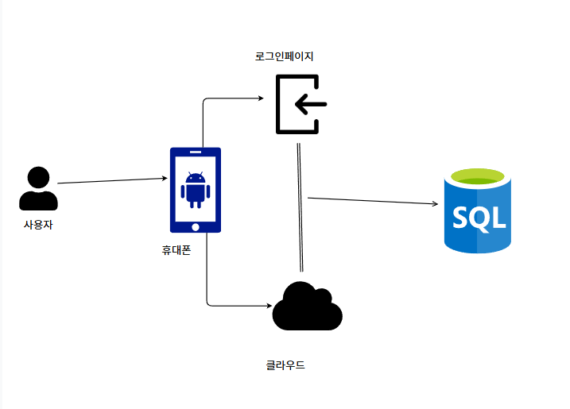
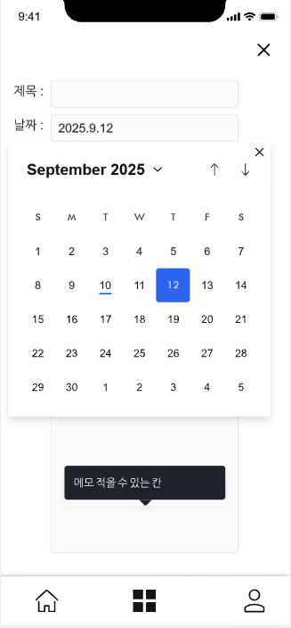
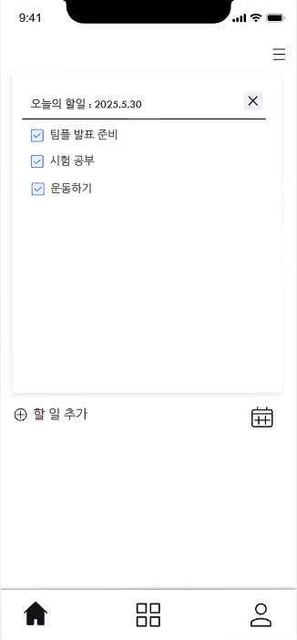

프로젝트: 일정 정리 웹 앱 - **Planuary**

개인 일정을 효율적으로 관리 할 수 있게한 간단한 일정 앱입니다.
일정 관리를 할 수 있는 어플은 많지만 만족스러운 것이 별로 없어서 계획하게 됐습니다.

단순한 계획으로 시작했지만, 점점 기능을 추가했더니 다음과 같은 여러가지 기능을 만들게 되었습니다.

<주요 기능>

- 일정 추가 / 수정 / 삭제
- 오늘 일정만 보기
- 주간 단위 일정 보기
- Firebase 로그인 (구글 계정 연동)
- Firestore를 통한 클라우드 데이터 저장 및 동기화
- 서버 없이도 작동 가능 (Firebase Hosting, 정적 웹서버 지원)

<문제 상황 및 해결 내용>

문제 상황 발생: 앱에 일정을 등록했는데, 앱을 종료하고 다시 실행하면 등록했던 일정이 모두 사라집니다.

문제 발생원인 : 앱이 꺼지면 메모리에 저장된 내용이 초기화되기 때문에 데이터가 영구적으로 저장되지 않았던 것이 문제였습니다.

해결 방법  
- Room 데이터베이스를 도입해 일정을 영구 저장하도록 수정했습니다.
- 일정 추가 시 `insert()` 함수를 통해 DB에 저장되도록 연결했습니다.
- 앱 실행 시 `getAllSchedules()` 함수로 DB에 저장된 일정을 불러오도록 하여, 이제 앱을 껐다 켜도 일정이 유지됩니다.

<기술 선택 이유>

Firestore 선택 이유

실시간 동기화: 여러 기기에서 동일한 계정으로 실시간 업데이트 가능  
사용자 인증: Firebase Authentication으로 로그인 기능 간편하게 구현  
유연한 문서 구조: 사용자별 일정 데이터를 문서 단위로 관리  
서버 불필요: 별도 백엔드 없이 강력한 기능 제공  
무료 요금제: 개인/소규모 프로젝트에 적합

> 예시 구조: `users/{userId}/schedules/{scheduleId}`

<API 설계 개요>

### RESTful 방식 기반

| 동작         | 메서드 | 엔드포인트 |
|--------------|--------|-------------|
| 일정 전체 조회 | GET    | `/schedules` |
| 일정 추가     | POST   | `/schedules` |
| 일정 수정     | PUT    | `/schedules/{scheduleId}` |
| 일정 삭제     | DELETE | `/schedules/{scheduleId}` |

Firebase를 직접 다루지 않고 **API 인터페이스로 추상화할 계획**  
- 이후 자체 백엔드 구축 시에도 구조를 그대로 확장 가능

<GraphQL 도입 가능성>

- 클라이언트가 필요한 데이터 필드만 가져올 수 있어 효율적  
- 웹/모바일 등 **멀티 플랫폼 대응**에 유리  
- 초기에는 REST로 시작, 향후 복잡해질 경우 GraphQL 전환 고려

---

<아키텍처 구성>

설명:

1. 사용자(User)
   - 앱을 사용하는 일반 사용자입니다.

2. 모바일 디바이스(Android)
   - 사용자는 Android 앱을 통해 일정을 확인하거나 추가할 수 있습니다.

3. 로그인 페이지 (Firebase Authentication)
   - 앱 실행 시 Firebase 인증을 통해 사용자 인증을 수행합니다.
   - 인증 성공 시 사용자 고유 ID 기반으로 데이터 접근이 가능해집니다.

4. 클라우드 (Firebase Firestore / Room)  
   - Firestore: 로그인된 사용자 데이터를 클라우드에 저장하고 여러 기기에서 동기화합니다.  
   - Room: 로컬 DB로 사용되어 오프라인 시에도 일정 확인 및 추가 가능하게 만듭니다.

5. SQL 아이콘 (실제 저장소 역할)
   - Firestore 또는 Room DB가 내부적으로 데이터를 SQL 기반으로 관리함을 시각적으로 표현합니다.

> 로그인 → 인증된 사용자 → 클라우드 저장소 접근 → 앱에서 일정 불러오기 및 저장  
> 이 흐름이 그림으로 한눈에 나타나 있습니다.

---

<디자인 설명 (UI 구성 및 UX 고려사항)>

스플래시 화면

  
- 단순한 로고 중심 디자인으로 가독성과 인상을 살렸습니다.  
- 앱 이름 “Planuary”는 Plan + January의 조합으로, 연초 계획의 의미를 담고 있습니다.

---

일정 입력 화면  

  
제목과 날짜를 입력하면 일정을 저장할 수 있습니다.  
달력 UI는 직관적이고 모바일 친화적인 디자인으로 구현했습니다.  
하단에는 메모를 적을 수 있는 영역이 있으며, 필요한 경우 확장 가능합니다.

---

오늘의 일정 확인 화면  
  
오늘 등록한 일정만을 모아서 보여줍니다.  
완료된 일정은 체크 표시로 확인할 수 있으며, 체크 상태는 저장됩니다.  
하단 '+' 버튼으로 새로운 일정을 손쉽게 추가할 수 있도록 구성했습니다.

---

<폴더 구조>

- index.html
- style.css
- script.js
- README.md

  향후 백엔드 기능이 추가되면 구조가 변경될 수 있습니다.  
  현재는 프론트엔드 중심 구성입니다.

| 팀원   | 담당 내용 |
|--------|-----------|
| **최동운** | DB 설계, 팀원 조율, 발표 |
| **윤혁**   | 로그인 화면 구현, 문서 작성 (PPT) |
| **이가은** | 일정 관련 기능 구현 (수정, 삭제, 검색), 자료 조사 |

---

<라이선스>

MIT License를 따릅니다.  
자유롭게 복사, 수정, 사용하실 수 있으며,  
다만 사용 중 발생한 문제에 대해서는 책임지지 않습니다.

기타

이 앱을 사용한다고 갑자기 계획적인 사람이 되진 않겠지만,  
기존 메모 앱보다 보기 편하고 관리도 쉬워서 만족하며 사용 중입니다.

피드백이나 개선 아이디어가 있다면 PR 또는 Issue 남겨주세요.  
자주는 못 보지만, 확인 후 반영할 수 있도록 하겠습니다.
